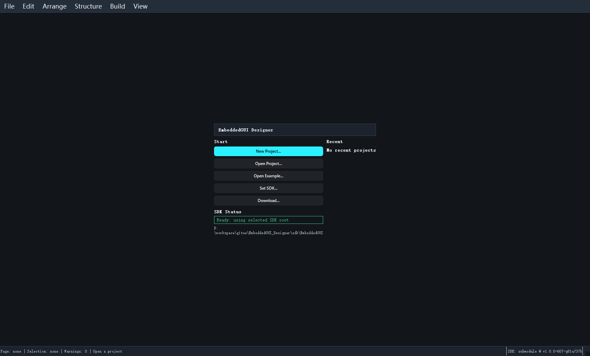

# 首次启动与欢迎页

欢迎页是你进入 Designer 后看到的第一个界面，它把首次使用最关键的入口集中在了一起。

## 欢迎页上最重要的几个按钮

你通常会先用到这几个入口：

- `New Project...`
- `Open Project...`
- `Open Example...`
- SDK 设置或下载入口

如果你之前打开过工程，欢迎页还会显示最近项目列表。

## 第一次启动建议做什么

建议按下面顺序处理：

1. 先确认 SDK 是否已经识别到 `sdk/EmbeddedGUI`
2. 如果没有识别到，先设置 SDK
3. 如果只是熟悉功能，优先点 `Open Example...`
4. 如果准备正式做项目，再点 `New Project...`

## Recent 项目的作用

最近项目适合日常回到上次工作现场，但不适合做首次功能熟悉。原因很简单：

- 最近项目可能依赖旧的 SDK 路径
- 最近项目可能已经包含本地改动
- 对新用户不如示例工程稳定

## 如果欢迎页提示 SDK 不可用

这时不要急着新建工程，先做下面几件事：

1. 检查 `sdk/EmbeddedGUI` 是否存在
2. 检查子模块是否已初始化
3. 用 `File -> Set SDK...` 手动指定 SDK 根目录
4. 再回到欢迎页或重新启动软件

## 推荐的首次体验路径

最稳的一条路径是：

1. 启动软件
2. 点击 `Open Example...`
3. 打开 `DesignerSandbox` 或 `HelloSimpleDemo`
4. 看清左栏、画布、属性区和 Build 菜单的位置

继续阅读：[新建工程](06_new_project.md) 或 [打开示例与已有工程](07_open_example_and_project.md)
