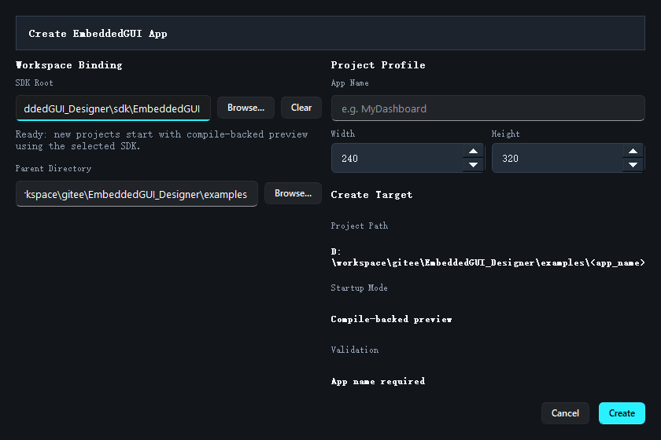

# 新建工程

如果你不是继续维护已有工程，而是要从零开始，推荐直接用 `New Project` 对话框创建。



## 打开方式

可以从两个地方进入：

- 欢迎页 `New Project...`
- 菜单 `File -> New Project`

## 对话框里要填什么

这个对话框主要收集三类信息：

1. `SDK Root`
2. `Parent Directory`
3. `App Name`、画布宽高

其中最关键的是工程名和画布尺寸。

## 推荐填写规则

### App Name

建议使用：

- 英文
- 驼峰或清晰的单词组合
- 与最终应用目录同名

不建议：

- 空格
- 纯中文
- 过于随意的临时命名

### Parent Directory

这里不是 `.egui` 文件路径，而是工程父目录。Designer 会自动创建：

```text
<Parent Directory>/<App Name>/
```

### Canvas Size

这决定初始页面尺寸，通常直接对应目标屏幕分辨率。第一次做演示工程时，常见选择有：

- `240 x 320`
- `320 x 240`
- `320 x 480`

## 创建后会发生什么

点击确认后，Designer 会自动：

1. 创建项目目录
2. 初始化 `.egui` 工程文件
3. 创建默认 `main_page`
4. 脚手架化基础代码与资源目录
5. 立即打开这个新工程

## 什么时候会创建失败

最常见是目标目录冲突，也就是：

- 你选的目录已经存在
- 同名工程已存在

这时建议换一个新的父目录，或者换一个应用名，而不是覆盖旧工程。

## 新建后第一件事该做什么

建议立刻做下面三件事：

1. `Ctrl+S` 保存一次
2. 在页面里插入一个最简单的控件验证工作区是否正常
3. 看一下工程目录是否已经生成完整

继续阅读：[打开示例与已有工程](07_open_example_and_project.md) 和 [工程目录结构](08_project_structure.md)
