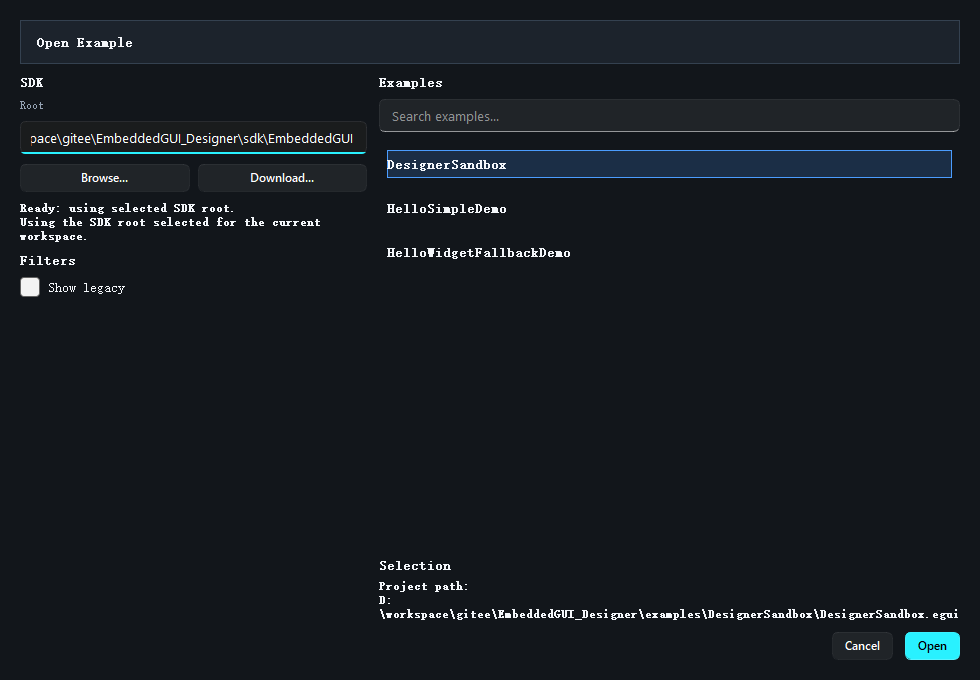

# 打开示例与已有工程

Designer 有三个常用入口都能把你带进工程，但它们面向的场景不同。

## 三种入口的区别

### Open Example...

适合：

- 第一次熟悉软件
- 快速验证 SDK 示例是否可打开
- 从仓库自带 Demo 开始修改

它会把 Designer 自带示例、SDK 内已有 Designer 工程、必要时的 legacy 示例放到一个入口里。

### Open Project...

适合：

- 你已经有 `.egui` 文件
- 你要打开某个明确的工程目录
- 你不想在示例列表里搜索

### Recent

适合：

- 回到自己上次正在做的工程
- 在固定项目之间高频切换

## 推荐什么时候用哪个

- 体验功能：优先 `Open Example...`
- 团队项目协作：优先 `Open Project...`
- 日常开发回到现场：优先 `Recent`

## 打开示例时建议从哪些工程开始

本仓库里建议优先尝试：

- `examples/DesignerSandbox`
- `examples/HelloSimpleDemo`

这两个工程更适合作为 Designer 的操作样例，而不是 SDK 的运行时复杂样例。

## 打开已有工程时要注意什么

请先确认三件事：

1. 工程目录里确实有 `.egui` 文件
2. 工程对应的 SDK 路径没有失效
3. 你知道哪些文件是源文件，哪些是生成文件

第三点很重要，后面在 [工程目录结构](08_project_structure.md) 会详细展开。

## 如果工程打不开

优先检查：

- 路径是否真的存在
- `.egui` 是否损坏
- SDK 是否失效
- 最近项目记录是不是指向了旧目录

继续阅读：[工程目录结构](08_project_structure.md)
