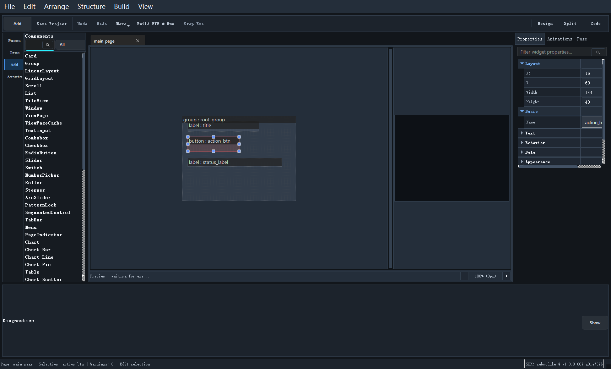

# 组件面板

`Components` 面板是插入控件的主入口。它既是控件浏览器，也是常用组件的快速入口。

## 组件面板能做什么

在这里你可以：

- 浏览当前支持的控件类型
- 搜索控件
- 收藏常用控件
- 把控件插入当前页面
- 让某个控件类型在结构树中定位

## 常用操作方式

### 直接插入

最常用的方式是选中一个组件后点击 `Insert`，或者使用面板提供的插入动作。

### 拖到画布

适合你已经知道大概要放在哪个区域，希望直接在画布上放置。

### Reveal in Structure

当页面已经有这个类型的控件，或者你想看树结构位置时，这个动作很方便。

## 如何选择合适的控件

建议不要一开始就堆复杂控件。更稳妥的顺序是：

1. 先放容器
2. 再放文本和按钮
3. 最后补复杂控件、动画和资源绑定

这样能减少后续结构调整成本。

## 组件面板和结构面板的区别

一句话区分：

- `Components` 面向“我要加什么”
- `Structure` 面向“我现在已经加了什么，它们怎么组织”

继续阅读：[画布编辑](12_canvas_editing.md)
