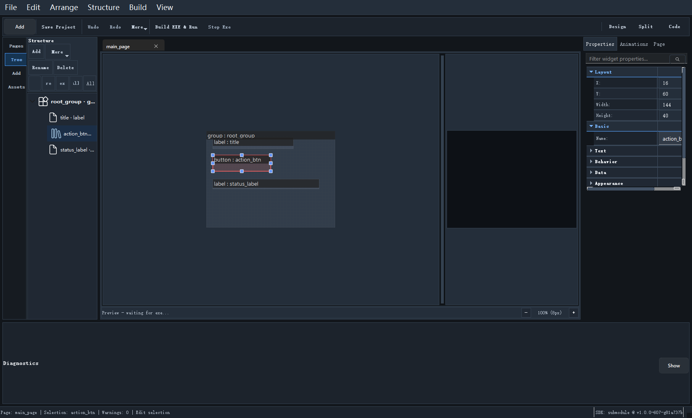

# 结构面板

当页面开始变复杂后，单纯在画布里点选已经不够用了。这时你需要依赖 `Structure` 面板来管理控件树。

## 结构面板解决什么问题

它主要处理四类事情：

1. 看清页面层级
2. 快速定位控件
3. 调整顺序和父子关系
4. 做结构性批量操作

## 你会经常用到的动作

常见动作包括：

- Rename
- Group / Ungroup
- Move Into
- Lift
- Move Up / Move Down
- Move Top / Move Bottom
- Delete

## 为什么复杂页面必须看结构树

因为很多视觉上“差一点”的问题，本质不是坐标问题，而是结构问题，比如：

- 控件放错父容器
- 兄弟顺序不对
- 容器裁剪关系错误
- 你以为改的是当前控件，其实选中了别的节点

## 分组和容器移动的建议

建议遵循一个原则：

先理顺父子关系，再做样式微调。

否则你会在后面不断碰到：

- 对齐失效
- 层级不对
- 多选结果异常

## 和画布配合的最佳方式

比较高效的方式通常是：

1. 在画布里大致放位置
2. 回到结构面板整理层级
3. 再去属性面板细调参数

继续阅读：[属性面板](14_property_panel.md)
