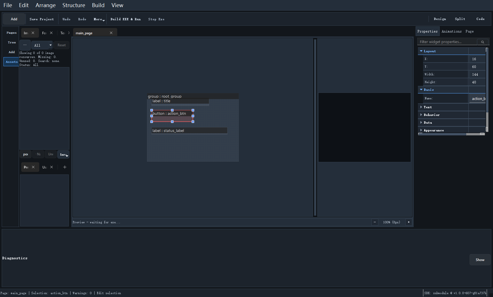

# 资源面板

资源面板对应左侧的 `Assets`，它负责管理工程用到的图片、字体、文本等资源。

## 资源面板的作用

它并不只是“放文件”的地方，而是整个工程资源索引的入口。你通常会在这里做：

- 导入资源
- 查看资源列表
- 重命名或删除资源
- 检查资源是否被页面引用
- 触发与资源相关的辅助操作

## 常见资源类型

在当前项目里，你最常见的资源通常有：

- 图片
- 字体
- 文本字符集文件
- 字符串资源

## 为什么不要只手动拷文件

因为 Designer 不只关心磁盘文件存不存在，还关心：

- 资源有没有被登记到工程里
- 资源名和引用名是否一致
- 资源是否会进入生成链路

所以，比较稳妥的方式永远是：

1. 优先通过资源面板操作
2. 必要时再检查磁盘目录

## 资源面板常见工作流

一个高频流程通常是：

1. 在资源面板导入图片或字体
2. 在属性面板把资源绑定到控件
3. 运行 `Generate Resources`
4. 再做 EXE 预览或 Release

## 什么时候要回到磁盘目录检查

只在下面几种场景建议直接看文件：

- 资源导入后列表不刷新
- 路径冲突
- 需要确认实际落盘位置
- 你在做版本比对或打包排查

继续阅读：[字符集生成器](16_font_charset_generator.md)
