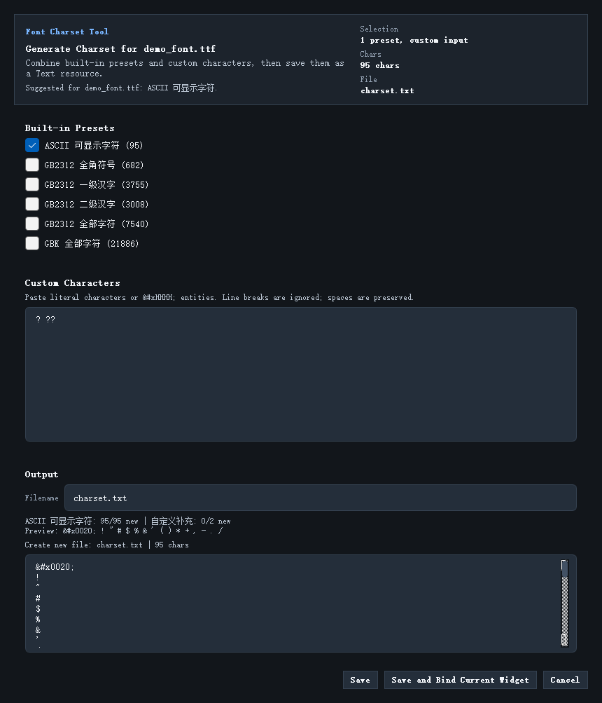

# 字符集生成器

如果项目里开始使用中文、特殊符号或图标字体，`Generate Charset...` 是非常关键的工具。

## 这个功能解决什么问题

它用来生成项目级的字符集文本资源，避免你手动维护一堆 `.txt` 文件。

最典型的用途有：

- 给字体裁剪出精确字符集
- 引入中文字符
- 引入温度符号、单位符号等特殊字符
- 减少字体资源体积

## 入口在哪

通常可以从资源相关入口进入：

- 资源面板里的 `Generate Charset...`
- 某些字体绑定场景下的快捷入口

## 对话框里有什么

这个工具主要由三块组成：

1. 内置预设
2. 自定义字符输入
3. 输出文件和预览

## 推荐使用方式

比较稳的一种方式是：

1. 先选一个合适的内置预设
2. 再补自定义字符
3. 预览结果
4. 保存为项目内的文本资源
5. 必要时直接绑定到当前控件

## 什么时候用 Save and Bind Current Widget

适合下面两种场景：

- 你正在为一个具体控件补字符集
- 你希望减少“生成了文件但忘了绑定”的遗漏

## 使用时的注意点

- 字符集越大，字体资源越大。
- 不要图省事一开始就把所有字符都塞进去。
- 新增字符后，记得重新做资源生成和预览验证。

继续阅读：[Code/XML 模式](17_code_mode_and_xml.md)
