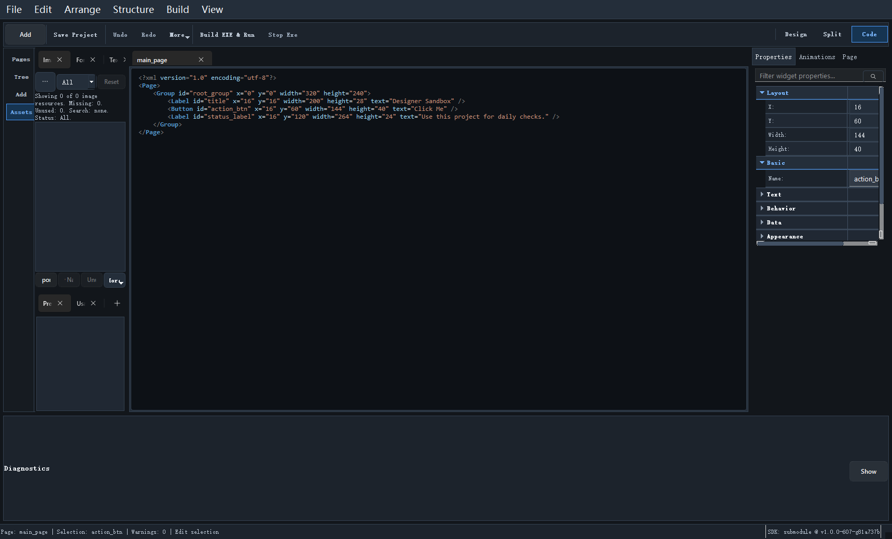

# Code/XML 模式

Designer 不只是可视化工具，它还支持直接查看和编辑页面 XML。

## 三种编辑模式

中央编辑区支持三种模式：

- `Design`
- `Split`
- `Code`

建议把它们理解成：

- Design：以拖拽和属性编辑为主
- Split：一边看 XML，一边看预览
- Code：专门处理 XML

## 什么情况下切到 Code 模式

通常有这些场景：

- 你要快速检查页面 XML 结构
- 你想做一些批量文本替换
- 你在排查页面结构异常
- 你在比较版本差异

## 改 XML 时要注意什么

Designer 对 XML 编辑的基本原则是：

- 只有当 XML 能成功解析时，变更才会真正应用到页面
- 临时的解析错误不会立即把工程改坏，但对应修改也不会生效

这意味着你在 Code 模式里编辑时，最好保持“小步修改，小步验证”。

## 什么时候优先用 Design，不要用 Code

这些工作更适合在 Design 模式里做：

- 摆位置
- 调尺寸
- 看选中反馈
- 做多控件对齐

因为它们需要即时视觉反馈，纯 XML 不直观。

## Split 模式的价值

如果你已经熟悉 XML，又不想丢掉视觉上下文，Split 模式是最合适的折中方案。

继续阅读：[预览与构建](18_preview_and_build.md)
