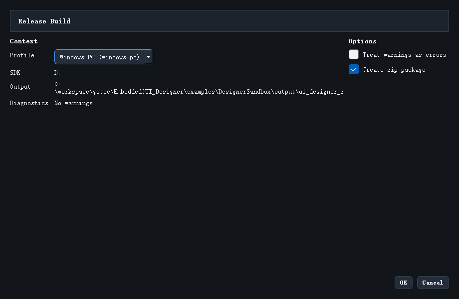

# Release Build

如果你要从当前工程直接生成可交付的桌面产物，应该使用 `Release Build`。



## 入口

菜单位置：

```text
Build -> Release Build (EXE)...
```

## 这个功能和普通 Build 的区别

两者的定位不同：

- `Build EXE && Run` 更偏向本地验证
- `Release Build (EXE)...` 更偏向正式产物输出

Release 流程会记录更多上下文，例如：

- 使用的 profile
- SDK 版本信息
- 输出目录
- manifest
- build log
- history

## 对话框里要确认什么

这个对话框主要让你确认三件事：

1. 使用哪个 Release Profile
2. 当前绑定的是哪个 SDK
3. 输出根目录和打包选项是否符合预期

## 常见选项

最重要的两个开关是：

- `Treat warnings as errors`
- `Create zip package`

如果你在做正式交付，第二项通常应该开启。

## 产物会输出到哪里

一个典型 Release 输出目录类似：

```text
output/ui_designer_release/<profile>/<build_id>/
```

常见文件包括：

- `release-manifest.json`
- `VERSION.txt`
- `logs/build.log`
- `dist/`
- `history.json`

## 什么时候适合开始做 Release

至少满足下面三条再做：

1. 工程能保存
2. 资源生成正常
3. 基本预览结果已经通过

否则 Release 记录里虽然也会保留失败信息，但你会更容易在中间问题上浪费时间。

继续阅读：[Release Profiles](21_release_profiles.md)
