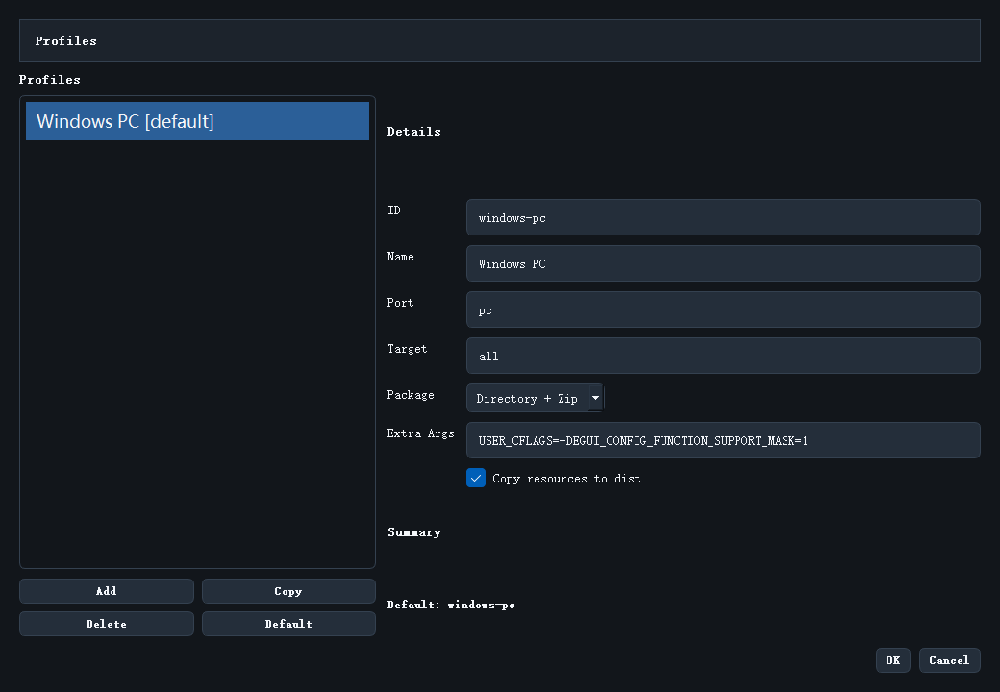

# Release Profiles

`Release Profiles` 用来管理一个工程可以怎样被打包。它决定的不只是名称，而是整条发布配置。



## 入口

菜单位置：

```text
Build -> Release Profiles...
```

## 为什么要有 Profile

因为同一个工程可能存在多种发布目标，例如：

- Windows 本地验证版
- 某个特定端口配置
- 带不同附加参数的构建版本

把这些差异做成 Profile，比每次手工改参数安全得多。

## 主要字段说明

当前对话框里最关键的字段有：

- `ID`
- `Name`
- `Port`
- `Target`
- `Package`
- `Extra Args`
- `Copy resources to dist`

## 推荐怎么命名

建议：

- `ID` 用稳定、简短、便于脚本识别的名字
- `Name` 用对人友好的显示名

例如：

- `windows-pc`
- `stm32-sim`

## 日常操作

常见动作有：

- `Add`
- `Copy`
- `Delete`
- `Default`

推荐先从一个可用 profile 复制，再改小部分差异，而不是每次从零新建。

## 什么时候需要多个 Profile

只有当这些条件之一成立时，才建议拆多个 profile：

- 构建参数明显不同
- 输出包格式不同
- 目标端口不同
- 团队需要区分测试包和正式包

继续阅读：[Release History](22_release_history.md)
