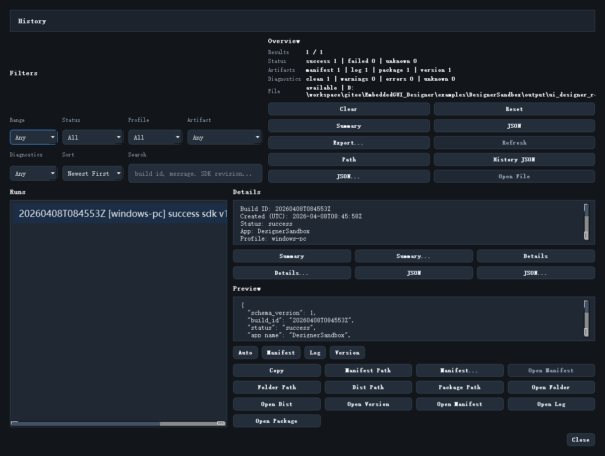

# Release History

每次 Release Build 之后，Designer 都可以把记录沉淀下来，后续通过 `Release History` 统一查看。



## 入口

菜单位置：

```text
Build -> Release History...
```

## 这个界面的价值

它不是一个简单的“列表”，而是一个回溯和审计面板。你可以在这里做：

- 看最近发布是否成功
- 按状态、时间、profile、诊断筛选
- 打开 manifest、log、dist、zip
- 导出历史摘要或 JSON

## 你会最常用到哪些筛选

高频筛选项通常是：

- `Status`
- `Profile`
- `Artifact`
- `Diagnostics`
- `Search`

如果你要排查某次失败构建，通常先筛：

1. `Status = Failed`
2. 再按 `Search` 搜 SDK 版本或 build id

## Preview 区域怎么看

Release History 不只是列信息，它还会把当前选中记录的关键信息预览出来。

常见预览内容有：

- Manifest
- Log
- Version
- 自动选择的最佳摘要

## Open Last Release 系列和它的关系

`Build` 菜单里还有一组快捷入口：

- Open Last Release Folder
- Open Last Release Dist
- Open Last Release Manifest
- Open Last Release Version
- Open Last Release Package
- Open Last Release Log

这些适合快速回到最近一次构建，而 `Release History` 更适合做系统回看。

## history.json 在哪

典型位置为：

```text
output/ui_designer_release/history.json
```

也可以从 Build 菜单直接打开：

```text
Build -> Open Release History File
```

继续阅读：[Repository Health](23_repository_health.md)
