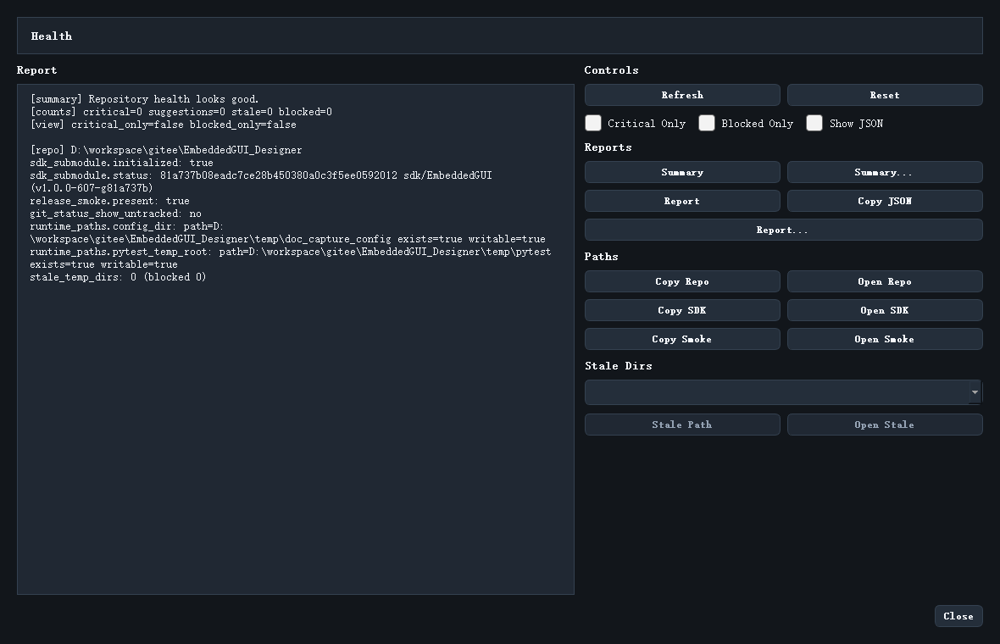

# Repository Health

`Repository Health` 是 Designer 里非常实用的一块诊断面板，适合在“到底是工程问题、SDK 问题还是仓库状态问题”分不清的时候使用。



## 入口

菜单位置：

```text
Build -> Repository Health...
```

## 这个界面主要看什么

它会聚合与工作区状态直接相关的信息，例如：

- 仓库根目录状态
- SDK 子模块路径
- Release Smoke 示例位置
- 临时目录或 stale 目录
- 诊断摘要

## 指标怎么理解

最常见的四个指标是：

- `Critical`
- `Suggestions`
- `Stale Dirs`
- `Blocked`

可以把它理解成：

- Critical：会直接影响使用
- Suggestions：建议处理，但不一定阻塞
- Stale Dirs：遗留目录
- Blocked：当前无法继续自动处理的问题

## 这个界面适合什么时候打开

建议在下面几种场景优先打开：

- SDK 明明在，但 Designer 说不可用
- Release 路径混乱
- 本地缓存目录太多
- 你想确认 smoke sample 是否齐全

## 和命令行 repo_doctor 的关系

二者本质上是同一类能力的不同入口：

- 图形界面里看：`Repository Health...`
- 命令行里看：`python scripts/ui_designer/repo_doctor.py --summary`

如果你要写报告、贴工单或发给同事，GUI 里的复制和导出按钮会更方便。

继续阅读：[常见问题排查](24_troubleshooting.md)
